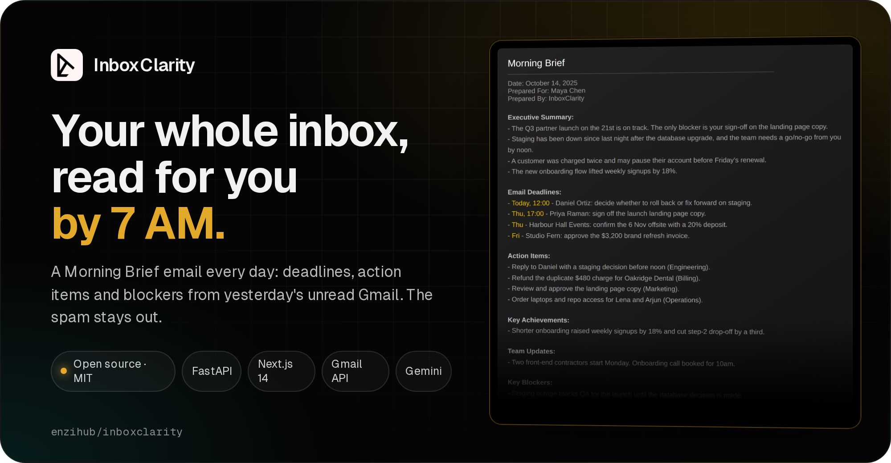
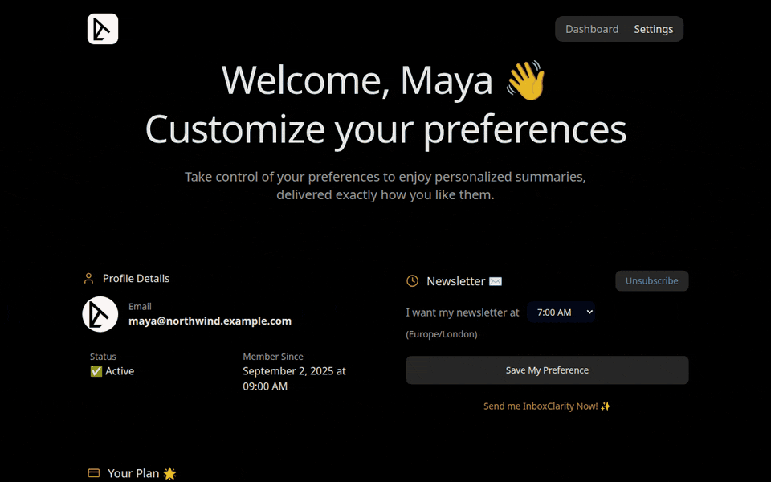
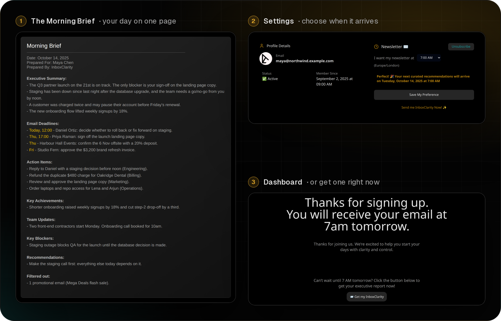
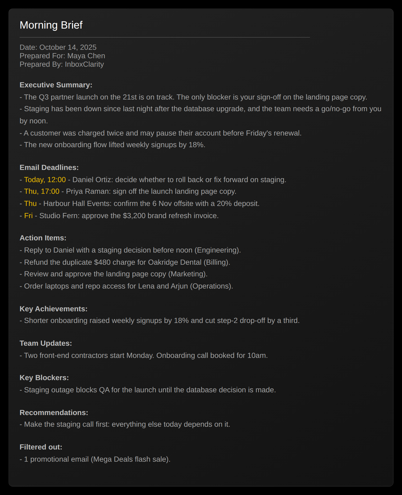
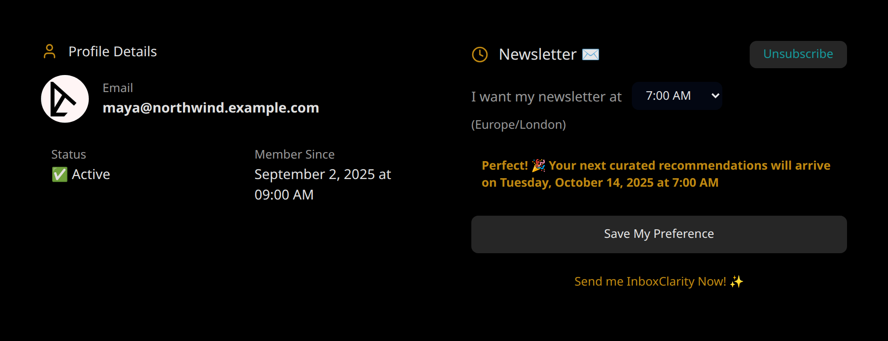
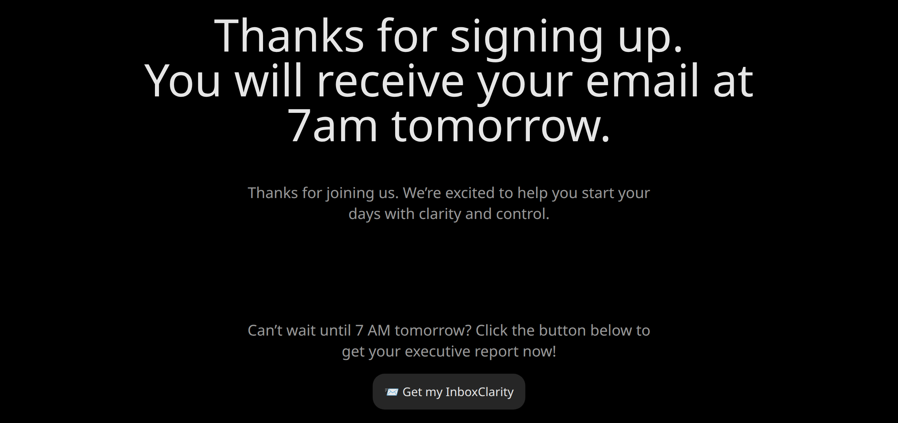
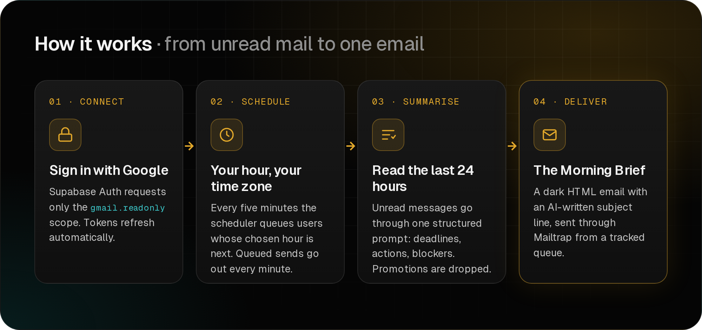

<div align="center">

<a href="https://enzihub.github.io/inboxclarity/">
  
</a>

<br>

**[Website](https://enzihub.github.io/inboxclarity/)** ·
**[Demo](#see-it-work)** ·
**[Features](#features)** ·
**[How it works](#how-it-works)** ·
**[Quick start](#quick-start)** ·
**[Configuration](#configuration)**

<br>

[](https://fastapi.tiangolo.com)
[](https://nextjs.org)
[](https://supabase.com)
[](https://developers.google.com/gmail/api)
[](LICENSE)

</div>

## Why

Most mornings start with forty unread emails and no idea which three matter. InboxClarity reads the last 24 hours of your unread Gmail and sends you one email, the **Morning Brief**, at the hour you choose. It lists who needs a reply and by when, what to do next, what is blocked and what went well. Promotions are left out.

## See it work

<div align="center">
  
  <br>
  <sub>The real app, recorded headless on 127.0.0.1. Gmail, Supabase and the AI model are stubbed. Every person, company and email address is invented (<code>core/demo/inbox.json</code>).</sub>
</div>

<br>

<div align="center">
  
</div>

## Features

### The Morning Brief

One structured prompt turns yesterday's unread mail into fixed sections: executive summary, email deadlines, action items, key achievements, team updates, blockers and recommendations. The result goes into a dark HTML email with an AI-written subject line.



### Your hour, your time zone

Users pick the hour they want their brief. The browser's time zone is saved with it, and the scheduler converts both to UTC. Users can unsubscribe and resubscribe from the same card.



### Get one now

The dashboard has a button that asks the backend to build and send a brief straight away, so new users do not wait until tomorrow.



### Also in the box

- **Google sign-in** through Supabase Auth with the `gmail.readonly` scope and offline access. The backend refreshes expired Gmail tokens itself.
- **Stripe billing**: checkout, customer portal and a webhook that syncs products, prices and subscriptions into Supabase. Only trialing or paying users get briefs.
- **A send queue** in Postgres with status, attempt count and error message for every brief.
- **Slack slash commands** (`/news`) that summarise a Slack channel the same way. Optional.

## How it works

<div align="center">
  
</div>

```
web/   Next.js 14 (App Router) + Supabase Auth + Stripe   sign-in, settings, billing
core/  FastAPI + APScheduler                              Gmail fetch, AI summary, email send
       ├─ app/gmail       unread mail from the last 24 hours
       ├─ app/ai          the Morning Brief prompt (Gemini; an OpenAI client is included)
       ├─ app/newsletter  render, queue and send (Mailtrap)
       └─ app/demo.py     DEMO_MODE: invented inbox, stubbed model, local outbox
```

Every five minutes the scheduler calls a Postgres function that returns the users whose chosen hour is coming up. It builds their brief and puts it in `inboxclarity_newsletter_queue`. A second job runs every minute and sends whatever is due.

## Quick start

### 1. Try it with no accounts (demo mode)

This runs the real backend and the real web app against an invented inbox. Nothing leaves your machine.

```bash
git clone https://github.com/enzihub/inboxclarity && cd inboxclarity

# backend on :8812
cd core
python3 -m venv .venv && .venv/bin/pip install -r requirements.txt
DEMO_MODE=1 .venv/bin/uvicorn main:app --host 127.0.0.1 --port 8812
```

Open <http://127.0.0.1:8812/demo/brief> to see the Morning Brief, `/demo/inbox` for the invented emails, and `/demo/prompt` for the exact prompt the model would get.

To run the web app as well, use two more terminals:

```bash
cd web
npm ci
npm run demo:supabase   # a tiny local stand-in for Supabase with one fictional user
npm run demo            # Next.js on http://127.0.0.1:3000
```

Then open <http://127.0.0.1:54399/demo/login>. It signs you in as the demo user and opens Settings. "Send me InboxClarity Now" writes a brief to `core/demo/outbox/`.

> [!NOTE]
> The demo uses a fake session. Google sign-in, Stripe checkout and real email sending need the real services below.

### 2. Run it for real

1. Create a Supabase project and run the SQL in `web/supabase/migrations/`.
2. In Google Cloud, create an OAuth client, enable the Gmail API and add the `gmail.readonly` scope. Turn on the Google provider in Supabase Auth.
3. Copy `web/.env.example` to `web/.env.local` and `core/.env.example` to `core/.env`, then fill them in.
4. Optional: load the Stripe products with `stripe fixtures web/src/stripe-fixtures.json` and point a webhook at `/api/webhooks`.
5. Start both apps:

```bash
cd core && .venv/bin/uvicorn main:app --port 8000
cd web && npm run dev
```

Run the backend tests with `cd core && .venv/bin/python -m pytest`.

## Configuration

Every value in the example files is empty. Nothing personal ships with the repo.

| Variable | Where | What it is |
| --- | --- | --- |
| `NEXT_PUBLIC_SUPABASE_URL`, `NEXT_PUBLIC_SUPABASE_ANON_KEY` | web | Your Supabase project URL and anon key |
| `SUPABASE_SERVICE_ROLE_KEY`, `SUPABASE_JWT_SECRET` | web | Server-side Supabase access and JWT check |
| `SUPABASE_PROJECT_REF` | web | Only for the `npm run supabase:*` and `generate-types` scripts |
| `SITE_URL`, `NEXT_PUBLIC_SITE_URL` | web | Public URL of the web app (OAuth redirects) |
| `NEXT_PUBLIC_CORE_API_URL`, `CORE_API_URL` | web | URL of the FastAPI backend |
| `NEXT_PUBLIC_AUTHORIZED_EMAILS` | web | Emails that see the "send me a brief now" button in Settings |
| `STRIPE_SECRET_KEY`, `STRIPE_WEBHOOK_SECRET` | web | Stripe billing |
| `NEXT_PUBLIC_SUPPORT_EMAIL`, `NEXT_PUBLIC_WELCOME_VIDEO_URL` | web | Optional footer contact and dashboard video |
| `NEXT_PUBLIC_GA_ID`, `NEXT_PUBLIC_GTM_ID` | web | Optional analytics. Off when empty |
| `DEMO_MODE` | core | `1` uses the invented inbox, a stubbed model and a local outbox |
| `GOOGLE_CLIENT_ID`, `GOOGLE_CLIENT_SECRET` | core | Same OAuth client as Supabase, used to refresh Gmail tokens |
| `GEMINI_API_KEY` | core | Writes the brief and the subject line |
| `OPENAI_KEY` | core | Optional alternative client in `app/ai/openai.py` |
| `SUPABASE_URL`, `SUPABASE_ANON_KEY` | core | Same Supabase project |
| `MAILTRAP_API_TOKEN`, `FROM_EMAIL`, `FROM_NAME`, `EMAIL_SUBJECT` | core | Email sending |
| `LOGO_URL`, `APP_SETTINGS_URL` | core | Logo and "manage preferences" link inside the email |
| `SLACK_SIGNING_SECRET`, `SLACK_BOT_TOKEN` | core | Optional Slack commands. Slack requests are rejected when unset |
| `SENTRY_DSN` | core | Optional error tracking |

## Status

InboxClarity was built by Enzi Studio in 2025 and is shared as-is. It is not maintained and it is not a hosted service, so expect to update dependencies before you deploy it. The old marketing site was a Framer export full of tracking scripts, so it is not included. [`docs/`](docs/) is a new page made for this release.

## Credits

Built by **Enzi Studio**. Contributors to the original repositories:
[@RukshanJS](https://github.com/RukshanJS) ·
[@sun2ii](https://github.com/sun2ii) ·
[@bb-xops](https://github.com/bb-xops) ·
[@harrythentrepreneur](https://github.com/harrythentrepreneur) ·
[@ZainAli104](https://github.com/ZainAli104) ·
[@kavishkanimsara](https://github.com/kavishkanimsara)

The website and images use the [Geist](https://github.com/vercel/geist-font) typeface (SIL Open Font License 1.1).

## Licence

[MIT](LICENSE) © 2025-2026 Enzi Studio (Harry Edwards)
